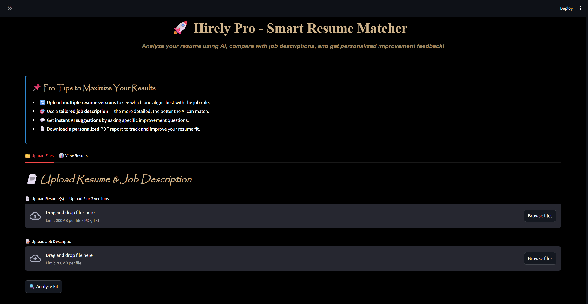

# 🧠 Hirely Pro – Your AI-Powered Career Companion

   

Welcome to **Hirely Pro**, your personalized **AI career assistant** that doesn’t just analyze resumes—it understands them.

Designed for job seekers, students, and career coaches, **Hirely Pro** goes beyond basic keyword matching. It intelligently **analyzes your resume**, compares it with **real job descriptions**, uncovers **missing skills**, and even chats with you to **help tailor your resume live**.

> ✨ Developed by **Sumukh Mallikarjuna**, this project merges AI, career analytics, and user-friendly design to help you land your dream job smarter, not harder.

---

## 🎁 Why Hirely Pro Is Different

✅ **Multi-Resume Comparison** – Upload up to 3 versions and let AI decide the best fit.  
✅ **Dual AI Engines** – Compare insights from **Groq LLaMA3** and **Google Gemini** side-by-side.  
✅ **Live Chat Assistant** – Ask resume questions in real-time with ResBot (always visible!).  
✅ **Skill Gap Radar** – Get a breakdown of missing skills with improvement suggestions.  
✅ **PDF Career Report** – Download a beautifully formatted match report with your summary, scores, and recommendations.  
✅ **Persistent Chat Memory** – Automatically saves chat sessions with custom titles.

---

## 🔍 How It Works

1. **Upload** your resume(s) and a job description.
2. **Analyze Fit** – Get AI-generated match scores, missing skills, and a candidate summary.
3. **Chat with ResBot** – Ask questions like “How can I tailor this resume better for this role?”
4. **Download PDF Report** – Instantly receive a tailored report to improve your resume.
5. **View All Results** – Interactive bar charts and resume-by-resume feedback.

---

## 🧱 Built With

| Layer        | Tools Used                                  |
|--------------|---------------------------------------------|
| Frontend     | Streamlit, HTML/CSS, Plotly                 |
| Backend      | Python, FPDF, pdfplumber                    |
| AI Models    | Groq LLaMA3 (8B + 70B), Google Gemini 2.0   |
| File Handling| Multi-resume ingestion, PDF + TXT support   |
| Memory       | JSON-based local chat history system        |

---

## 💻 How Hirely AI looks like🤔:

### It looks like this:



---

## ⚙️ Setup & Run Locally

### 🔐 Step 1: Clone and Install

```bash
git clone https://github.com/Sumukh-15/HirelyAI.git
cd Hirely
python -m venv venv
source venv/bin/activate  # For Windows: venv\Scripts\activate
pip install -r requirements.txt
```
---

### 🔑 Step 2: Add Your API Keys
Create a .env file:
```bash
GROQ_API_KEY=your_groq_key_here
GOOGLE_API_KEY=your_gemini_key_here
```

---

### 🚀 Step 3: Run the App
```bash
streamlit run main.py
```
Then open http://localhost:8501 in your browser.

---

## 📁 Project Structure
```bash
Hirely-Pro/
│
├── chat_history/        # Auto-saved chat sessions with ResBot
├── chat_sessions/       # Session titles and metadata
├── temp_files/          # Uploaded resume & JD processing
├── multi_file_ingestion.py
├── main.py              # Streamlit app entry point
├── requirements.txt
├── .env                 # Environment keys (not pushed)
└── README.md
```

---

## 🧠 Sample Prompts for ResBot

> 💬 Use these prompts inside the always-visible chat assistant:

> **“What are 3 things I should improve in this resume for a software role?”**  
> **“Is my resume strong enough for a data analyst job?”**  
> **“What skills am I missing compared to this JD?”**  
> **“How can I reword my project experience to look more impactful?”**

---

> ## 👨‍💻 About the Developer  
> **Sumukh Mallikarjuna**  
> Aspiring Software Engineer | Passionate about AI ✨  
> Devoted to solving real-world problems with simple tech + intelligence.  
>
> 💼 Open to collaborations, internships, and AI-for-career startups.  
> 💬 Connect with me on [LinkedIn](https://linkedin.com/in/sumukh-mallikarjuna) or check out more on [GitHub](https://github.com/Sumukh-15)

---

## 📃 License

This project is licensed under the MIT License.
Feel free to fork, modify, or contribute!

---

## ⭐️ Support the Project

If you found Hirely Pro helpful, give it a ⭐️ on GitHub, and share it with your peers. Every star helps others discover this unique career booster.
